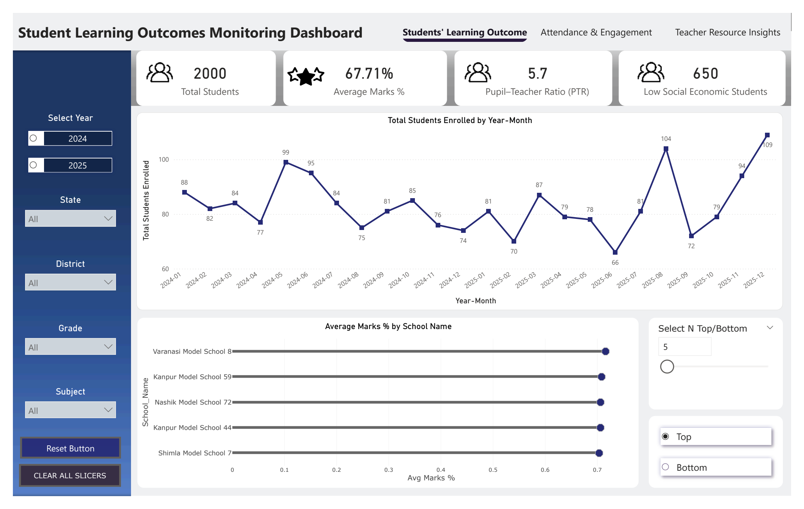
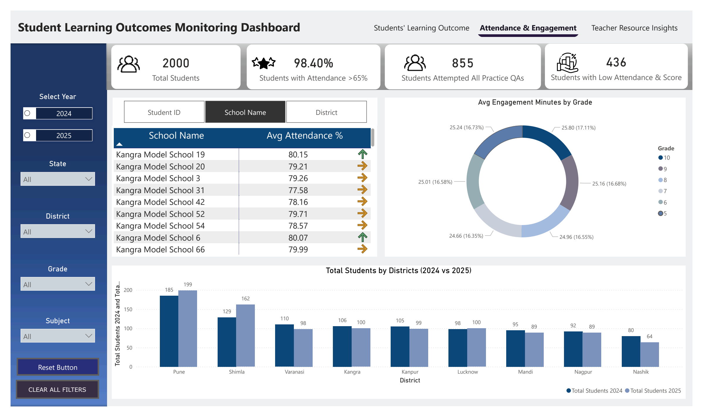
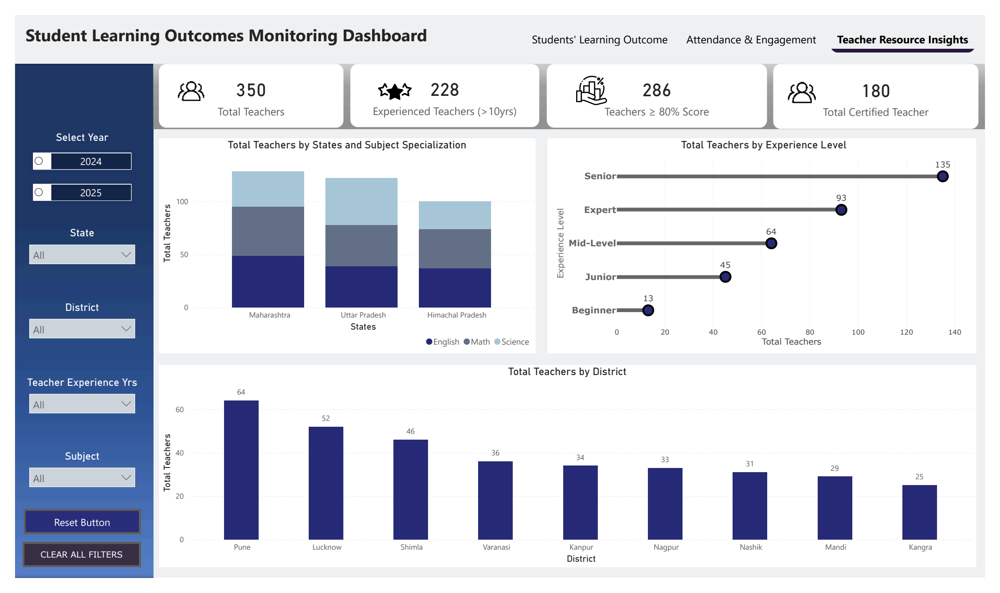

# 🎓 Student Learning Outcomes Monitoring Dashboard

**Domain:** Education Analytics

## 📌 Business Challenge

Education administrators lacked a unified system to monitor student performance, attendance behavior, and teacher effectiveness across districts. Data existed in silos, making it difficult to:

- identify underperforming schools early
- track attendance and engagement trends
- allocate experienced teachers where needed
- support low socio-economic and at-risk students
- make timely, data-driven policy decisions

## 🎯 Analytical Objective

Design a centralized analytics solution to:

- ✔ monitor academic outcomes and engagement trends
- ✔ evaluate school and district performance
- ✔ measure teacher effectiveness and experience distribution
- ✔ identify risk indicators affecting learning outcomes
- ✔ enable leadership to take targeted corrective actions

## 🛠️ Solution Approach

Developed an interactive Power BI dashboard integrating multiple datasets (students, attendance, assessments, teachers) into a single decision-support system.

**Data & Modeling**
- Designed a fact constellation schema (Galaxy Schema) with multiple fact tables (assessments, attendance, teacher metrics)
- Built dimension tables for Date, Schools, Teachers, and Students
- Ensured optimized relationships for scalable reporting

**Features**
- Dynamic KPI monitoring for performance & engagement
- Time-series trend analysis
- Top/Bottom N school ranking
- Drill-down filtering by district, grade, and subject
- Page navigation with reset filters for smooth exploration

## 📄 Full Report

[📥 Student Learning Outcomes Monitoring Dashboard.pdf](Student%20Learning%20Outcomes%20Monitoring%20Dashboard.pdf)

---

## 🔹 Student Learning Outcomes

**What was analyzed:**
- Average marks and performance distribution
- Monthly enrollment trends
- School-level performance comparison
- Pupil–Teacher Ratio (PTR)
- Low socio-economic student count

**Key Insights:**
- Performance variation exists across schools, highlighting targeted improvement needs.
- PTR variations suggest potential teacher workload imbalance.
- Schools with higher low-SES populations may require additional academic support.

---

## 🔹 Attendance & Engagement Insights

**What was analyzed:**
- Attendance compliance (>65%)
- Students attempting practice assessments (90% of the total 200 questions)
- Students with low scores and low attendance (attendance < 62% and score < 40%)
- Engagement minutes by grade
- Total students' comparison (2024 vs 2025)

**Key Insights:**
- High attendance compliance indicates strong participation but does not always correlate with performance.
- Engagement levels vary by grade, suggesting differences in curriculum difficulty or student motivation.
- Some districts show lower attendance consistency, indicating localized intervention needs.
- Students with low attendance and low scores form a critical risk group.

---

## 🔹 Teacher Resource Insights

**What was analyzed:**
- Teacher experience distribution
- Teachers scoring >80% in training assessments
- Subject specialization distribution
- Total certified teachers
- District-wise teacher allocation

**Key Insights:**
- A significant portion of teachers fall in mid-level experience, indicating future leadership pipeline needs.
- Schools with experienced teachers show stronger performance trends.
- Training excellence (>80%) highlights high-quality instructional readiness.
- Uneven teacher distribution suggests optimization opportunities.
